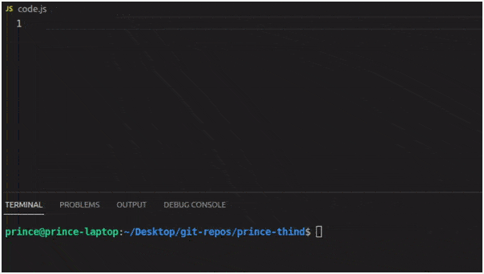

<a href="https://prince-thind.github.io/">
<kbd>

</kbd> 
</a>

# Hello! 👋

I am Prince Thind and I am a ~~Spider Man~~ web developer. Over the past few years, I have worked with many technologies and now I like to identify as someone who has ~~no social life~~ good command of many modern web technologies. Head straight to my [portfolio][0] for a ~~cooler~~ professional introduction or to my [about][1] page for a more casual introduction. Oh and I use the free and ~~far more superior~~ Open source Operating system GNU/Linux.

- 🌱 Always learning new stuff
- 🎓 Pursuing B.tech CSE(Hons.) from LPU
- 💼 ~~Looking for work opportunities~~ (not until I graduate)
- 🖥️ I like ~~communism~~ Open Source
- 🐧 Linux is Love

 

# Some Stats to make me look Cool

   
   &nbsp; &nbsp; &nbsp; &nbsp; 
   

# Talk is cheap. Show me the code!

<kbd>

</kbd>

 

<!-- links to your social media accounts -->

[0]: https://prince-thind.github.io/
[1]: https://prince-thind.github.io/about
